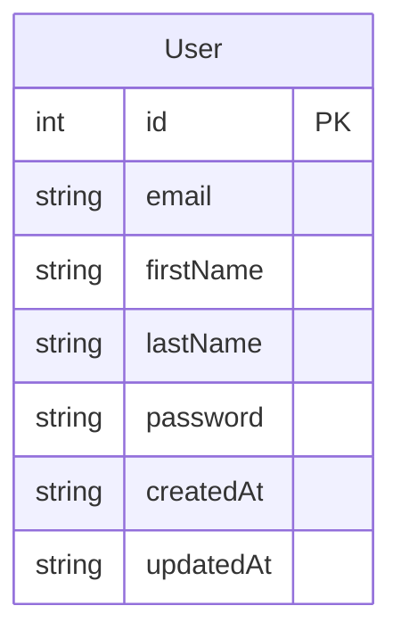
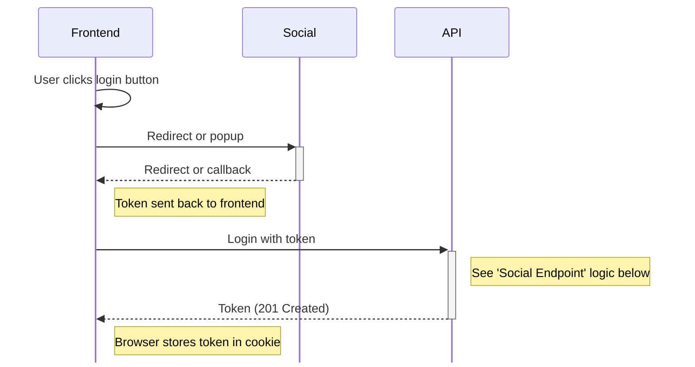
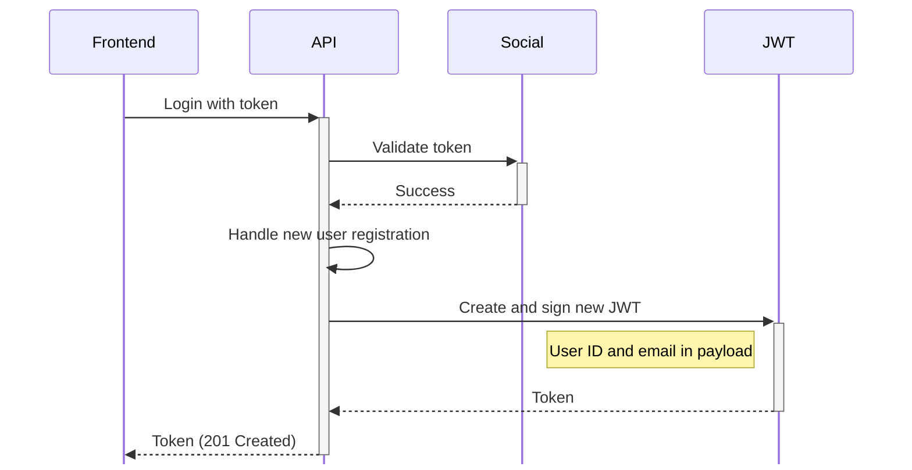

import GumroadEmbed from "@site/src/components/GumroadEmbed";

# Social Authentication

This recipe will show you how to use social providers like Google, Facebook and more to authenticate users. This recipe is an extension of the [Username & Password recipe](/recipes/users-auth/username-password).

:::tip

Looking for complete code samples? Check the [ready made code](#ready-made-code) section!

:::

## Ingredients

Most social providers will require the following:

1. Use of their HTML/Javascript libraries
2. Use of their server-side library
3. A developer account and a client ID
4. A configured OAuth Consent Screen

### Google Sign In

Below are links to the **Sign in with Google** versions of the above ingredients.

1. [HTML/Javascript libraries](https://developers.google.com/identity/gsi/web/guides/client-library)
2. [Server-side libraries](https://developers.google.com/api-client-library)
3. [Account & OAuth Consent Screen setup guide](https://developers.google.com/identity/gsi/web/guides/get-google-api-clientid)

## Considerations

Social login is just another way of authenticating a user instead of using traditional methods like a username and password. Instead of checking the provided credentials against records in the database, you are trusting a third party to verify the user's credentials instead.

Because this now means a user can log in with several different methods, some additional complexity is introduced, in particular these scenarios:

| Problem                                                                                                | Mitigation                                                                                                                                                                    |
| ------------------------------------------------------------------------------------------------------ | ----------------------------------------------------------------------------------------------------------------------------------------------------------------------------- |
| A user registers using a social provider but later wants to sign in with a username/password           | The user can trigger a reset password flow to create a password for their account.                                                                                            |
| A user changes their email address                                                                     | Social login will still work, but they will need to use an account that matches the new email address. The social account they previously used will no longer work            |
| The social provider only returns name and email, more information needs to be captured on registration | A field (e.g `onboarded`) can be added to the User database table. If set to `false`, your app can force the user to complete an additional step before being able to log in. |

## Outputs

### Screens

| Name      | Path     | Description                                                                           |
| --------- | -------- | ------------------------------------------------------------------------------------- |
| Login     | `/login` | Displays the social sign in buttons and redirects to the social provider login screen |
| Dashboard | `/`      | Only accessible if the user has a valid JWT issued. Fetches data from `GET /me`       |

### Endpoints

| Method | Path          | Description                                                   |
| ------ | ------------- | ------------------------------------------------------------- |
| POST   | `/auth/token` | Verifies the token from the social provider and issues a JWT. |
| GET    | `/me`         | Returns the current user's details, only if logged in         |

### Tables



## Method

### Login Screen

The login page typically uses one of the social provider's Javascript SDKs

- Google

#### Logic

:::tip
The token issued by the social provider is NOT the same as the token generated by your backend. Your backend should exchange the social token for one you create yourself.
:::



### Token Endpoint

The `POST /auth/token` endpoint accepts the token issued by the social provider and returns a JSON web token (JWT) which should be stored by the client for subsequent requests.

#### Request Body

```json
{
  "data": {
    "type: "credentials",
    "attributes": {
      "provider": "google",
      "token": {
        "clientId": "719961940556-....apps.googleusercontent.com",
        "client_id": "719961940556-....apps.googleusercontent.com",
        "credential": "eyJhbGciOiJSUzI1NiIsImtpZ...eZv73XtATkZqlEN8z42_Yv4Xr8PwvvnzxKj7NzPkjgNwxvZHL88ari9Sg",
        "select_by": "btn"
      }
    }
  }
}
```

#### Logic



#### Response Body

```json
{
  "accessToken": "eyJhbGciOiJIUzI1NiIsInR5cCI6IkpXVCJ9..."
}
```

## Further Reading

- [Sign in with Google for Web](https://developers.google.com/identity/gsi/web/guides/overview)

## Ready-Made Code

Download this recipe as a complete application!

<GumroadEmbed slug="social-auth" />
